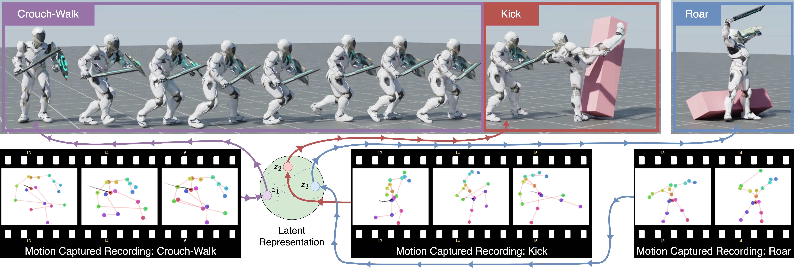

# Conditional Adversarial Latent Models

Code accompanying the paper:
"[CALM: Conditional Adversarial Latent Models for Directable Virtual Characters](https://research.nvidia.com/labs/par/calm/)" \



CALM builds upon, and borrows code from, Adversarial Skill Embeddings ([Peng et. al., 2022, ASE](https://github.com/nv-tlabs/ASE)).


### Installation

Download Isaac Gym from the [website](https://developer.nvidia.com/isaac-gym), then
follow the installation instructions.

Once Isaac Gym is installed, install the external dependencies for this repo:

```
pip install -r requirements.txt
```


### CALM

#### Pre-Training

First, a CALM model can be trained to imitate a dataset of motions clips using the following command:
```
python calm/run.py --task HumanoidAMPGetup --cfg_env calm/data/cfg/humanoid_calm_sword_shield_getup.yaml --cfg_train calm/data/cfg/train/rlg/calm_humanoid.yaml --motion_file calm/data/motions/reallusion_sword_shield/dataset_reallusion_sword_shield.yaml --headless  --track
```
`--motion_file` can be used to specify a dataset of motion clips that the model should imitate. 
The task `HumanoidAMPGetup` will train a model to imitate a dataset of motion clips and get up after falling.
Over the course of training, the latest checkpoint `Humanoid.pth` will be regularly saved to `output/`,
along with a Tensorboard log. `--headless` is used to disable visualizations and `--track` is used for tracking using weights and biases. If you want to view the
simulation, simply remove this flag. To test a trained model, use the following command:
```
python calm/run.py --test --task HumanoidAMPGetup --num_envs 16 --cfg_env calm/data/cfg/humanoid_calm_sword_shield_getup.yaml --cfg_train calm/data/cfg/train/rlg/calm_humanoid.yaml --motion_file calm/data/motions/reallusion_sword_shield/dataset_reallusion_sword_shield.yaml --checkpoint [path_to_calm_checkpoint]
```
You can also test the robustness of the model with `--task HumanoidPerturb`, which will throw projectiles at the character.

&nbsp;

#### Precision-Training

After the CALM low-level controller has been trained, it can be used to train style-constrained-locomotion controllers.
The following command will use a pre-trained CALM model to perform a target heading task:
```
python calm/run.py --task HumanoidHeadingConditioned --cfg_env calm/data/cfg/humanoid_sword_shield_heading_conditioned.yaml --cfg_train calm/data/cfg/train/rlg/hrl_humanoid_style_control.yaml --motion_file calm/data/motions/reallusion_sword_shield/dataset_reallusion_sword_shield_fsm_movements.yaml --llc_checkpoint [path_to_llc_checkpoint] --headless --track
```
`--llc_checkpoint` specifies the checkpoint to use for the low-level controller. A pre-trained CALM low-level
controller is available in `calm/data/models/calm_llc_reallusion_sword_shield.pth`.

To test a trained model, use the following command:
```
python calm/run.py --test --task HumanoidHeadingConditioned --num_envs 16 --cfg_env calm/data/cfg/humanoid_sword_shield_heading_conditioned.yaml --cfg_train calm/data/cfg/train/rlg/hrl_humanoid.yaml --motion_file calm/data/motions/reallusion_sword_shield/dataset_reallusion_sword_shield_fsm_movements.yaml --llc_checkpoint [path_to_llc_checkpoint] --checkpoint [path_to_hlc_checkpoint]
```

&nbsp;

#### Task-Solving (Inference -- no training!)

The CALM low-level controller and the high-level locomotion controller can be combined to solve tasks without further trianing.
This phase is inference only.
```
python calm/run.py --test --task HumanoidStrikeFSM --num_envs 16 --cfg_env calm/data/cfg/humanoid_sword_shield_strike_fsm.yaml --cfg_train calm/data/cfg/train/rlg/hrl_humanoid_fsm.yaml --motion_file calm/data/motions/reallusion_sword_shield/dataset_reallusion_sword_shield_fsm_movements.yaml --llc_checkpoint [path_to_llc_checkpoint] --checkpoint [path_to_hlc_checkpoint]
```
`--llc_checkpoint` specifies the checkpoint to use for the low-level controller. A pre-trained CALM low-level
controller is available in `calm/data/models/calm_llc_reallusion_sword_shield.pth`.
`--checkpoint` specified the checkpoint to use for the precision-trained high-level controller. A pre-trained high-level
precision-trained controller is available in `calm/data/models/calm_hlc_precision_trained_reallusion_sword_shield.pth`.

The built-in tasks and their respective config files are:
```
HumanoidStrikeFSM: calm/data/cfg/humanoid_sword_shield_strike_fsm.yaml
HumanoidLocationFSM: calm/data/cfg/humanoid_sword_shield_location_fsm.yaml
```

&nbsp;

&nbsp;

#### Task-Training

In addition to precision training, a high-level controller can also be trained to directly solve tasks.
The following command will use a pre-trained CALM model to perform a target heading task:
```
python calm/run.py --task HumanoidHeading --cfg_env calm/data/cfg/humanoid_sword_shield_heading.yaml --cfg_train calm/data/cfg/train/rlg/hrl_humanoid.yaml --motion_file calm/data/motions/reallusion_sword_shield/RL_Avatar_Idle_Ready_Motion.npy --llc_checkpoint [path_to_llc_checkpoint] --headless --track
```
`--llc_checkpoint` specifies the checkpoint to use for the low-level controller. A pre-trained CALM low-level
controller is available in `calm/data/models/calm_llc_reallusion_sword_shield.ckpt`.
`--task` specifies the task that the character should perform, and `--cfg_env` specifies the environment
configurations for that task. The built-in tasks and their respective config files are:
```
HumanoidReach: calm/data/cfg/humanoid_sword_shield_reach.yaml
HumanoidHeading: calm/data/cfg/humanoid_sword_shield_heading.yaml
HumanoidLocation: calm/data/cfg/humanoid_sword_shield_location.yaml
HumanoidStrike: calm/data/cfg/humanoid_sword_shield_strike.yaml
```
To test a trained model, use the following command:
```
python calm/run.py --test --task HumanoidHeading --num_envs 16 --cfg_env calm/data/cfg/humanoid_sword_shield_heading.yaml --cfg_train calm/data/cfg/train/rlg/hrl_humanoid.yaml --motion_file calm/data/motions/reallusion_sword_shield/RL_Avatar_Idle_Ready_Motion.npy --llc_checkpoint [path_to_llc_checkpoint] --checkpoint [path_to_hlc_checkpoint]
```

&nbsp;

&nbsp;


### AMP

We also provide an implementation of Adversarial Motion Priors (https://xbpeng.github.io/projects/AMP/index.html).
A model can be trained to imitate a given reference motion using the following command:
```
python calm/run.py --task HumanoidAMP --cfg_env calm/data/cfg/humanoid_sword_shield.yaml --cfg_train calm/data/cfg/train/rlg/amp_humanoid.yaml --motion_file calm/data/motions/reallusion_sword_shield/sword_shield/RL_Avatar_Atk_2xCombo01_Motion.npy --headless  --track
```
The trained model can then be tested with:
```
python calm/run.py --test --task HumanoidAMP --num_envs 16 --cfg_env calm/data/cfg/humanoid_sword_shield.yaml --cfg_train calm/data/cfg/train/rlg/amp_humanoid.yaml --motion_file calm/data/motions/reallusion_sword_shield/sword_shield/RL_Avatar_Atk_2xCombo01_Motion.npy --checkpoint [path_to_amp_checkpoint]
```

&nbsp;

&nbsp;

### Motion Data

Motion clips are located in `calm/data/motions/`. Individual motion clips are stored as `.npy` files. Motion datasets are specified by `.yaml` files, which contains a list of motion clips to be included in the dataset. Motion clips can be visualized with the following command:
```
python calm/run.py --test --task HumanoidViewMotion --num_envs 2 --cfg_env calm/data/cfg/humanoid_sword_shield.yaml --cfg_train calm/data/cfg/train/rlg/amp_humanoid.yaml --motion_file calm/data/motions/reallusion_sword_shield/sword_shield/RL_Avatar_Atk_2xCombo01_Motion.npy
```
`--motion_file` can be used to visualize a single motion clip `.npy` or a motion dataset `.yaml`.


If you want to retarget new motion clips to the character, you can take a look at an example retargeting script in `calm/poselib/retarget_motion.py`.
